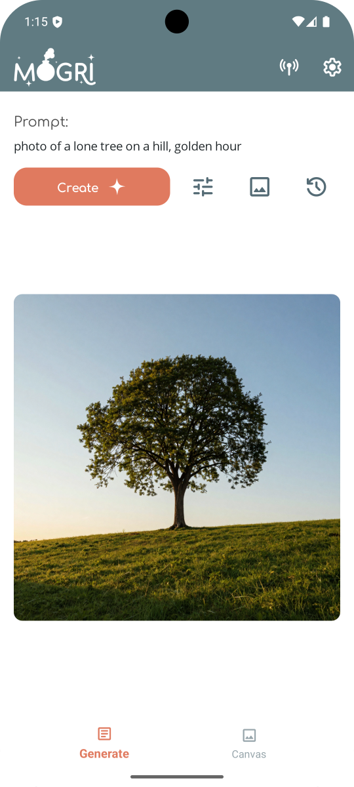
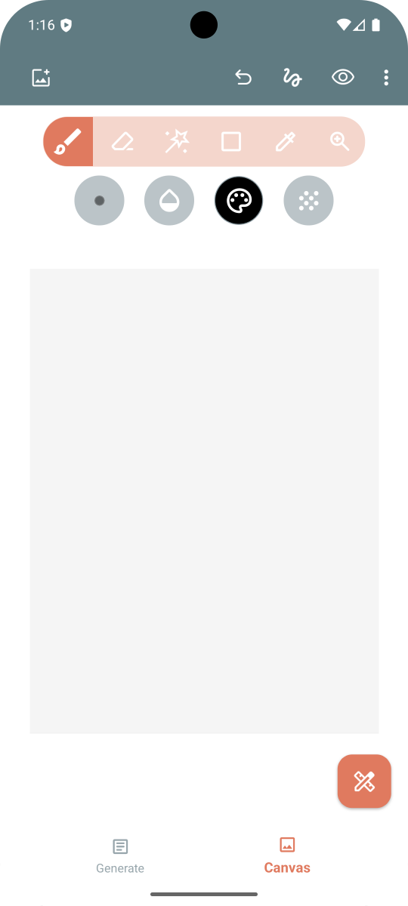
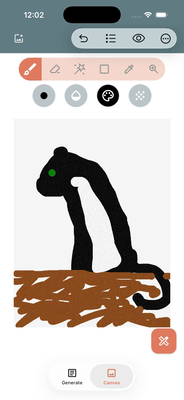
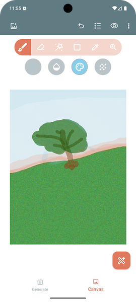
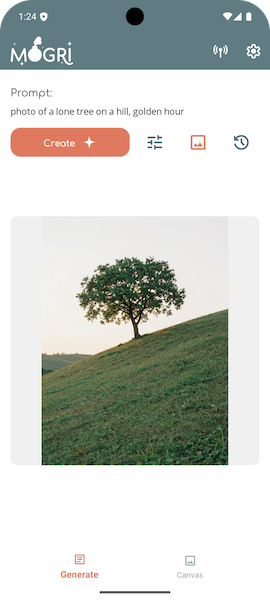

Mogri is a .NET MAUI mobile application for image generation and editing. It combines a finger-friendly mobile UI with a mix of on-device processing (masking/patching, etc.) and a user-provided remote server for heavy-duty generation tasks. While it is not a replacement for professional desktop image editors, Mogri aims to bridge that gap a bit with simple (but powerful) mobile workflows.

## Overview

There are two main tabs in the app:

| **Generate** | **Canvas** |
| --- | --- |
|  |  |
- **Generate**: Your main entry point to view generation results and edit settings. Image generation can continue in the background (when backgrounded, Android will show a notification with progress).
- **Canvas**: A workspace to mask/paint on images or draw freehand sketches to use as a base for generation.

### Example Workflows

#### Image generation and Inpainting

1. Generate a "photo of a cat".
2. Send the image to the `Canvas` tab.
3. Mask the area above the cat and send the updated canvas image back to the `Generate` tab by choosing the Inpainting option.
4. Generate with a new prompt (e.g., "wearing a top hat"), resulting in the cat now wearing a top hat.

&nbsp;&nbsp;&nbsp; 

#### Sketch to Image

1. Make a sketch on the `Canvas` page
2. Send it to the `Generate` tab as paint only (no masks)
3. Describe your sketch (or rather, what you want it to be)

&nbsp;&nbsp;&nbsp;  &nbsp;&nbsp;&nbsp;&nbsp;&nbsp;&nbsp; 

#### Touch-ups

1. In the `Canvas` tab, add a photo from your device.
2. Mask an unwanted object/blemish using the magic wand or brush tool.
3. After masking, you can approach it a few different ways:
   - Send the canvas image to the `Generate` tab, and give it a prompt (e.g. "a field of grass", "clear skin, close up"), and tap the `Create` button.
   - Use the Patch tool to fill in the masked space
   - A combination of the Patch tool *and* inpainting

> The Patch tool can be useful for filling in a space with contrasting colors (e.g. A red fire hydrant in a field of green grass), making it easier to follow up with inpainting for a better blend

## Getting Started

### Prerequisites

- An Android or iOS phone
  - **Android** - Just install the latest APK
  - **iOS** - Currently, sideloading is required for iOS as well (SideStore, etc.)
- A running instance of **SD Forge Neo**/**ComfyUI** or a **Comfy Cloud** API key.

### Configuration

1.  After launching Mogri, navigate to the **Settings** page.
2.  Select your backend (**SD Forge Neo**/**ComfyUI**/**Comfy Cloud**) from the dropdown.
3.  Enter your backend server URL (e.g., `http://192.168.1.x:7860`), or if using Comfy Cloud, enter your API Key.

### Backend Configuration

#### SD Forge Neo

To listen for connections on the local network with SD Forge Neo, launch with the `--listen` argument.  You can also set the port using the `--port` argument. These arguments can be added to `set COMMANDLINE_ARGS=` line in your `webui-user.bat` file.

#### ComfyUI

To listen for connectins on the local network in ComfyUI, [follow their official guide here](https://comfyui-wiki.com/en/faq/how-to-access-comfyui-on-lan).

## Architecture

Mogri follows the MVVM pattern and utilizes standard `.NET MAUI` features along with the `MVVM Toolkit`.

Notable libraries include `.NET MAUI Community Toolkit`, `SkiaSharp` for image operations and drawing, `LiteDB`, `Mopups`, `ColorMinePortable`, and `Microsoft.Kiota` for generating the OpenAPI backend clients. Additionally, it leverages `ML.NET` and the `ONNX Runtime` to run on-device machine-learning models for image segmentation and patching.

For a detailed breakdown of the application structure, including Views, ViewModels, and Services, please see [Architecture.md](docs/Architecture.md).

### FAQ (or *Possibly* Asked Questions)

#### Why make this? Aren't there better image editing/generation UIs out there?

This whole thing started as a fun learning exercise for me.  Also, I've found that most of the current image generation UIs (as of early 2026) aren't mobile friendly. The Gradio-based ones tend to break as soon as you leave the browser tab, and ComfyUI has a lot of complexity that is hard to adapt to mobile form factors.

The main goal for this project was to create a finger-friendly, simplified image editing/generation workflow that also exposes *some* of the more advanced settings that users might care about *(steps, samplers, denoising strength, model, LoRAs, etc.)*.

#### But I hate AI "art". Why contribute to that software space?

I hear you. Image generation is a complicated, controversial topic. I personally don't condone creating AI "art" for commercial purposes, particularly when models are trained on artists' work without their permission. That said, I also love the technology behind it, and it **does** have other uses besides imitating art. Since the early days of image generation (VQGAN-CLIP, Craiyon), I've looked at this tech as more of a toy/tool. I love to tinker, and this is a fun visual way to do it.

Mogri doesn't provide any models and instead leaves it up to the user to figure that part out. I think if any person is serious about creating and selling AI "art", they'll gravitate toward something else in the PC space, like ComfyUI etc.

#### Can you add a feature that I want?

I'm happy to entertain feature requests if they align with the Mogri vision of simplicity and user-friendliness.

#### Can you add support for X backend?

You're welcome to submit an issue and I'll consider it. Keep in mind that I'm just trying to support the most popular backends.